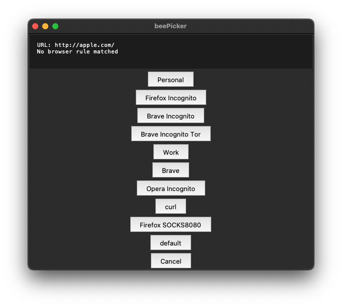
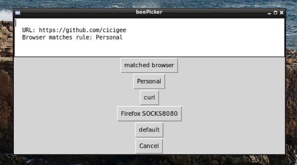
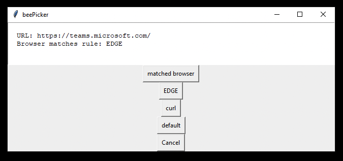
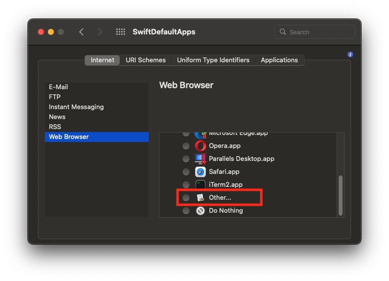

# beepicker
Cross-platform link handler

- Interactive list of browsers / applications
- Let's you choose which browser or app to open when opening links
- Intelligent URI matching rules
- Keyboard shortcuts

Tested in Windows 10 / MacOS 12.6 Monterey / Ubuntu 20.04 Focal Fossa

## Screenshots

### MacOS 12.6:

### Ubuntu Linux 20.04:

### Windows 10 21H2:

# Requirements
- Python 3.9
- Tkinter

# Installation

## Package application

https://pyinstaller.org/en/stable/

## Linux
`pip3 install tkinter`
`pip3 install PyYAML`

## Configuring your rules & browsers

Customize your `.bee_picker.yaml` file.

## Setting as your default browser

### Windows
Import [registry entries](/windows/app_registration.reg)

`SetUserFTA.exe https bee_picker.exe`

`SetUserFTA.exe http bee_picker.exe`

SetUserFTA is available here: [kolbi.cz](https://kolbi.cz/blog/2017/10/25/setuserfta-userchoice-hash-defeated-set-file-type-associations-per-user/)

### MacOS
Install [SwiftDefaultApps](https://github.com/Lord-Kamina/SwiftDefaultApps)

Select the app manually:

(or https://sveinbjorn.org/platypus if you want to use it to build the app bundle)

### Linux
Use update-alternatives:

`sudo update-alternatives --install /usr/bin/x-www-browser x-www-browser /opt/ceeceepro/bee_picker.py 200`

`update-alternatives --config x-www-browser`
